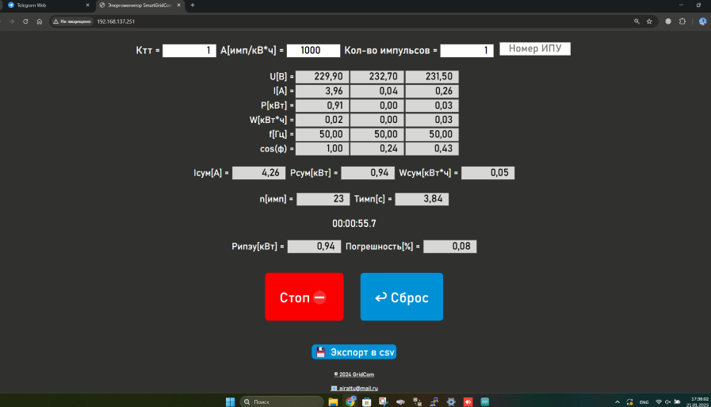

# Arduino_PZEM-nodemcu-web-wifi_three_phase_electricity_meter
### 3-фазный энергомонитор на Arduino (esp8266) с Wi-Fi и веб-интерфейсом с функцией автоматической проверки прибора учёта.
### Позволяет считать импульсы с проверяемого счётчика автоматически с помощью фотосенсора. Выводит в веб-интерфейс результаты измерений и расчёта погрешности прибора учёта.
### схема принципиальная:

## Комплектующие:
1. [ESP8266 NodeMCU V3](https://arduinomaster.ru/platy-arduino/esp8266-nodemcu-v3-lua/)
2. [3 х PZEM-004T V3.0](https://innovatorsguru.com/wp-content/uploads/2019/06/PZEM-004T-V3.0-Datasheet-User-Manual.pdf)
3. [KY-018](https://eclass.uth.gr/modules/document/file.php/E-CE_U_269/Sensors/Sensors_%20Datasheets/KY-018-Joy-IT.pdf)
   
Для работы системы необходимо [подключить](https://wiki.iarduino.ru/page/Installing_libraries) библиотеки:
1. https://github.com/mandulaj/PZEM-004T-v30 (в Arduino IDE: инструменты->управление библиотеками - "PZEM-004T-v30")
2. https://github.com/esp8266/Arduino (в Arduino IDE: инструменты->плата->менеджер плат - "esp8266 by ESP8266")
3. https://github.com/bblanchon/ArduinoJson  (в Arduino IDE: инструменты->управление библиотеками - "ArduinoJson") или https://arduinojson.org/?utm_source=meta&utm_medium=library.properties

### Особенности:
1. Если не подавать напряжение, то другие параметры измеряться тоже не будут (таковы особенности устройства PZEM)
2. Результат можно экспортировать в csv

### Если вы работаете с [Arduino IDE](https://docs.arduino.cc/software/ide/), Вам необходимо [подключить](https://robotclass.ru/articles/node-mcu-arduino-ide-setup/) дополнительные ссылки для Менеджера плат для NodeMCU:
http://arduino.esp8266.com/stable/package_esp8266com_index.json

### Пример корпуса устройства:

### В разобранном виде:

### веб интерфейс:

### можно выводить в монитор порта:

### использованные источники (благодарности)
1. [Подключаем Ардуино К Счётчику](https://www.instructables.com/%D0%9F%D0%BE%D0%B4%D0%BA%D0%BB%D1%8E%D1%87%D0%B0%D0%B5%D0%BC-%D0%B0%D1%80%D0%B4%D1%83%D0%B8%D0%BD%D0%BE-%D0%BA-%D1%81%D1%87%D1%91%D1%82%D1%87%D0%B8%D0%BA%D1%83/)
2. [Подключение нескольких PZEM-004t на ESP](https://rain.linuxoid.in/2021/03/07/%D0%BF%D0%BE%D0%B4%D0%BA%D0%BB%D1%8E%D1%87%D0%B5%D0%BD%D0%B8%D0%B5-%D0%BD%D0%B5%D1%81%D0%BA%D0%BE%D0%BB%D1%8C%D0%BA%D0%B8%D1%85-pzem-004t-%D0%BD%D0%B0-esp/)
3. [Веб-сервер AJAX на ESP8266: динамическое обновление веб-страниц без их перезагрузки](https://microkontroller.ru/esp8266-projects/veb-server-ajax-na-esp8266-dinamicheskoe-obnovlenie-veb-stranicz-bez-ih-perezagruzki/)
