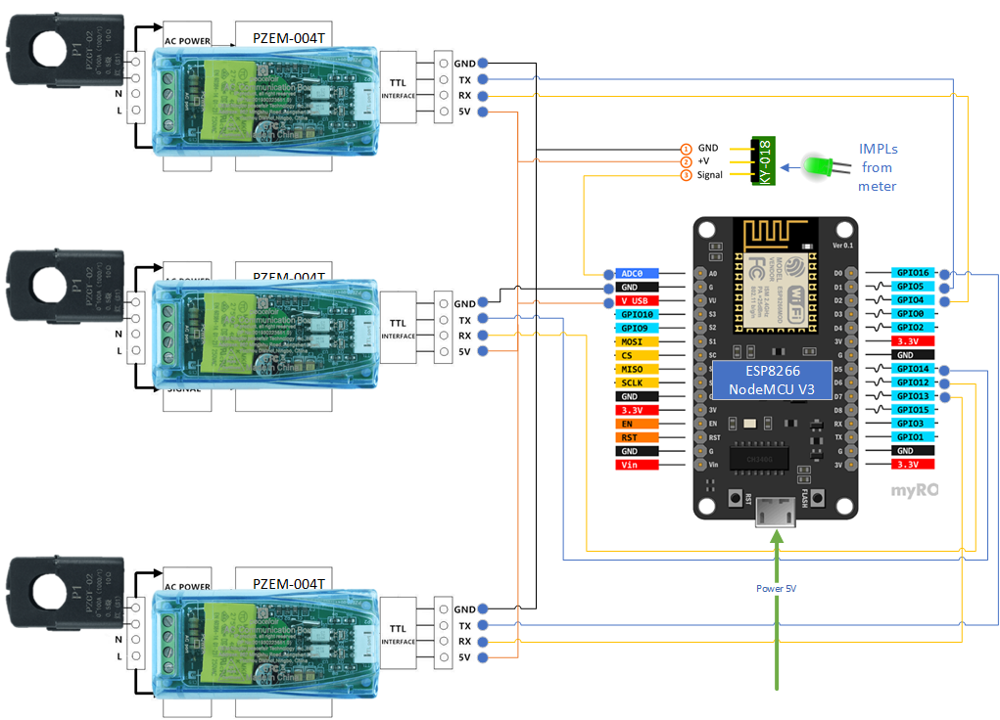

# Arduino_PZEM-nodemcu-web-wifi_three_phase_electricity_meter
### 3-фазный энергомонитор на Arduino (esp8266) с wifi и веб-интерфейсом с функцией автоматической проверки прибора учёта.
### Позволяет считать импульсы с проверяемого счётчика автоматически с помощью фотосенсора. Выводит в веб-интефейс результаты измерений и расчёта погрешности прибора учёта.

## Комплектующие:
1. [ESP8266 NodeMCU V3](https://arduinomaster.ru/platy-arduino/esp8266-nodemcu-v3-lua/)
2. [3 х PZEM-004T V3.0](https://innovatorsguru.com/wp-content/uploads/2019/06/PZEM-004T-V3.0-Datasheet-User-Manual.pdf)
3. [KY-018](https://eclass.uth.gr/modules/document/file.php/E-CE_U_269/Sensors/Sensors_%20Datasheets/KY-018-Joy-IT.pdf)
   
Для работы системы необходимо [подключить](https://wiki.iarduino.ru/page/Installing_libraries) библиотеку https://github.com/mandulaj/PZEM-004T-v30

### Если вы работаете с [Arduino IDE](https://docs.arduino.cc/software/ide/), Вам необходимо [подключить](https://robotclass.ru/articles/node-mcu-arduino-ide-setup/) дополнительные ссылки для Менеджера плат для NodeMCU:
http://arduino.esp8266.com/stable/package_esp8266com_index.json

